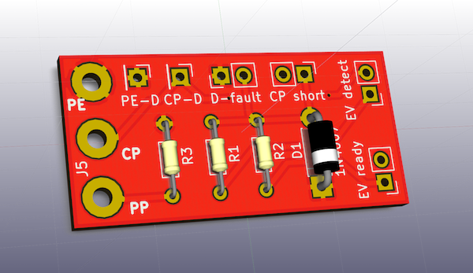

Bevor eine Ladesäule den Ladestrom freischaltet, wird zunächst eine
einfache Kommunikation mit dem Elektroauto aufgebaut. Dabei wird z.B.
geprüft, ob wirklich ein Elektroauto angeschlossen ist. Außerdem
wird dem Elektroauto auch der maximal verfügbare Ladestrom von der
Ladesäule mitgeteilt.

Der Simulator dient dazu, einer Typ 2-Ladesäule ein Elektroauto
vorzugaukeln.  Mit der hier vorgestellten Platine kann man z.B.

* Einen einfachen Funktionstester für Wallboxen bauen,
* einen Ladesäule-nach-Schuko-Adapter bauen oder
* einen eigenen Laderegler an Typ2-Ladesäulen anschließen.

Der Simulator implementiert das Ladeprotokoll nach DIN EN 61851 bzw.
J1772. Die passende Platine kann für eigene Experimente gekauft werden,
siehe [Bezugsquelle](#bezugsquelle).  Die Platine entstand, weil ich
eine Softwareschnittstelle zu einer Wallbox entwickeln wollte. Da der
Ladevorgang das mindestens das Durchlaufen der Zustände A-C vorsieht hab
ich einen kleinen Simulator gebraucht, der auf dem Schreibtisch liegen
kann und ein Auto simuliert. Mit diesem Simulator kann man (fast) alle
Ladezustände eines Elektroautos simulieren und die Reaktion der Wallbox
messen. Über die Schalter lassen sich verschiedene Widerstände
einstellen sowie Fehler wie eine defekte Diode und einen Kurzschluss
zwischen CP und PE simulieren.

---

# Wie kommuniziert das Elektroauto mit der Ladesäule?

Eine Typ 2-Steckdose beinhaltet nicht nur die Stromversorgung, sondern
auch zwei Kommunikationsleitungen. Über diese werden folgende Funktionen
koordiniert (vgl. DIN EN 61851-1):

* Überprüfung, dass das Fahrzeug vorschriftsmäßig angeschlossen ist,
* ständige Überwachung des Schutzleiterdurchgangs,
* Einschalten des Systems,
* Ausschalten des Systems,
* Auswahl des Ladestroms,
* Einstellen des Ladestroms,
* Sperren/Freigeben der Stecker.

Ein Typ2-Stecker benutzt folgenden Leitungen:

* Einem Drehstromanschluss, also die drei Außenleiter L1, L2 und L3,
	einem Neutralleiter N sowie einer Schutzerde PE.
* Einer Signalleitung "Proximity Plug" (PP), über welche
	die Strombelastbarkeit des Kabels erkannt wird.
* Einer Signalleitung "Control Pilot" (CP). Auf dieser Leitung werden
	Sicherheitsprüfungen durchgeführt sowie der zu verwendende Ladestrom dem
	Elektroauto mitgeteilt. Das Elektroauto signalisiert außerdem, ob es
	für eine Ladung bereit ist.

Die Kommunikation kann mit einfachen analogen Bauteilen ausgewertet
werden, siehe z.B. [AnalogEVSE](http://analogevse.xyz). Auf der Seite
des Fahrzeugs sind nur sehr wenige Komponenten erforderlich.

## Der Proximity Plug (PP)

Der maximal zulässige Ladestrom, den das Kabel verkraftet, wird über
einen Widerstand zwischen PP und der Schutzerde PE kodiert. Nach DIN EN
61851-1 sind folgende Widerstände zulässig:

| Widerstand | Maximaler Ladestrom |
|-----------:|--------------------:|
| 100 Ohm    |               63 A  |
| 220 Ohm    |               32 A  |
| 680 Ohm    |               20 A  |
| 1500 Ohm   |               13 A  |

Werte kleiner als 75 Ohm oder größer als 2200 Ohm werden als Fehler
interpretiert. Dieser Widerstand beschreibt den *maximalen* Ladestrom:
Würde dieser überschritten, so würde das Kabel beschädigt werden. Der
reale Ladestrom muss also kleiner bleiben. Der Widerstand muss eine
Belastbarkeit von mehr als 0,5 Watt haben.

Üblicherweise wird ein entsprechender Widerstand in den Typ2-Stecker
selbst integriert. Das Gehäuse des Steckers bietet viel Platz für einen
Widerstand --- mit etwas Schrumpfschlauch entsteht so ein robuster und
sicherer Aufbau. Die EVSim-Platine bietet aber ebenso einen Platz für
den Widerstand.

## Der Control Pilot (CP)

Der Control Pilot setzt die restlichen Funktionen um. Dabei
schaltet das Elektroauto zwei verschiedene Widerstände zwischen CP und
PE. Zusätzlich wird eine Diode in CP gesetzt.  Die Wallbox erzeugt ein
Kleinspannungssignal, welches dann durch die Widerstände und die Diode
verändert wird. Dadurch können verschiedene Zustände detektiert und der
momentan verfügbare Ladestrom kommuniziert werden.

Die folgenden sechs Zustände sind möglich:

| Zustand| Fzg. angeschlossen | Laden möglich | Spannung CP-PE  | Frequenz |
|:-------|:-------------------|:--------------|----------------:|:---------|
| A      | Nein               | Nein          | 12V             |DC        |
| B      | Ja                 | Nein          | 9V/-12V         |1 kHz     |
| C      | Ja                 | Ja            | 6V/-12V         |1 kHz     |
| D      | Ja                 | Ja            | 3V/-12V         |1 kHz     |
| E      | Ja                 | Nein          | 0V              | -        |
| F      | Ja                 | Nein          | -/-12V          | -        |

Im Zustand A ist kein Fahrzeug angeschlossen. Die Wallbox legt eine
Gleichspannung von 12V zwischen CP und PE an. Sobald ein Kabel
eingesteckt wird, wechselt die Wallbox in den Status B: Die
Gleichspannung wird durch ein PWM-Signal mit 1kHz ersetzt, zwischen -12V
und 12V. Die Diode im Fahrzeug bewirkt, das der negative Anteil
verworfen wird. Auf diese Weise kann die Wallbox ein Fahrzeug von einem
zufälligen Kurzschluss (z.B. Kabel liegt im Regen) unterscheiden. Im
Fahrzeug wird außerdem ein Widerstand von 1k2 Ohm zwischen CP und PE
geschaltet. Damit sinkt die positive Spannung auf 9V ab. Das Fahrzeug
ist nun korrekt angeschlossen und der Zustand B erreicht.

Sobald das Fahrzeug zum Laden bereit ist wird ein weiterer Widerstand
(2k7 Ohm) zwischen CP und PE geschaltet. Damit sinkt die CP-PE-Spannung
auf 6V, der Zustand C ist erreicht. Die Wallbox schaltet den Ladestrom
frei, der Ladevorgang beginnt. Für das Laden von Bleibatterien kann eine
Lüftungsanforderung gesendet werden (Zustand D). Damit signalisiert ein
Fahrzeug, das für einen Ladevorgang eine Belüftung notwendig ist --- die
Wallbox kann diese entweder sicherstellen oder den Ladevorgang
abbrechen. *Achtung:* Dieser Anwendungsfall ist mittlererweile recht
selten. Daher ist auf der Platine dieser Widerstand nicht vorgesehen.

Die Zustände E und F sind Fehlerzustände, in denen die Stromversorgung
zum Elektroauto unterbrochen wird. E zeigt einen Kurzschluss zwischen CP
und PE an. Der Zustand F kennzeichnet einen Ausfall der Wallbox, d.h.
zwischen CP und PE besteht keine Verbindung.

# Funktionsweise der Platine

Der komplette [Schaltplan ist hier (PDF)](img/Schaltplan.pdf). Die
einzelnen Komponenten stelle ich im Folgenden vor. Zunächst einmal
bietet die Platine eine Anschlußmöglichkeit für PP, CP und PE:

Daran können die entsprechenden Signalleitungen des Ladekabels an die
Platine angeschlossen werden. Diese bietet für CP und PE wiederum einen
separaten Anschluss an:

Dort kann man z.B. Messbuchsen verbinden, um den Control Pilot
beobachten zu können. Diese Anschlussmöglichkeit kann aber auch
ungenutzt bleiben.

Um den Strom des Ladekabels festzulegen wird ein Widerstand zwischen PP und PE benötigt. Dieser wird auf der Platine R3 genannt und wird mit 220 Ohm (min. 0,5 Watt, für 32 A Strombelastbarkeit) bzw. einem anderen Widerstandswert bestückt:

Normalerweise wird dieser Widerstand direkt im Typ2-Stecker montiert.
Wer allerdings aus Platzgründen die Platine direkt in den Stecker
einbaut, hat hier die Möglichkeit, den Widerstand zu bestücken.

Damit ein Ladestrom freigegeben wird, muss das Elektroauto zwei weitere
Widerstände in CP einschalten (N1 ist ein internes Netz):

R1 (2k7 Ohm, min. 0,5 Watt) signalisiert der Wallbox, das ein
Elektroauto angeschlossen ist. Der Widerstand R2 (1k2, min. 0,5W)
zeigt die Ladebereitschaft an. Die beiden Widerstände werden über einen
separaten Anschluß (J2 und J4) geschleift, damit man über einen
Kippschalter die Widerstände in CP einschleifen kann. Wer nur Dauerstrom
entnehmen möchte kann die J2 sowie J4 einfach mit einer Drahtbrücke
permanent verbinden.

Abschließend fehlt noch die Diode D1 (1N4007). Diese sorgt dafür, das
der negative Anteil des Pilotsignals weggeschnitten wird. Anhand dieses
Signals erkennt die Wallbox, das tatsächlich ein Elektroauto
angeschlossen ist --- und der Stecker nicht einfach nur im Regen hängt.

Normalerweise ist J1 geöffnet, d.h. die Wallbox detektiert ein
Elektroauto. Verbindet man einen Kippschalter mit J1, so kann man einen
Diodenfehler simulieren und so die Sicherheitsabschaltung der Wallbox
testen.

Ebenso kann man an J3 einen Kippschalter anschließen. Wird dieser
geschlossen, simuliert man einen Kurzschluss von CP --- auch bei diesem
Fehler muss die Wallbox den Strom abschalten.

# Aufbauanleitung

*ACHTUNG: Netzspannung kann tödlich sein. Jeder ist für seine Aufbauten
selbst verantwortlich. Die im nachfolgenden dargestellten
Aufbauvarianten sind nur als Denkanstoß zu verstehen und dienen nicht
als Bauanleitung für betriebsfertige Geräte.  Insbesondere hafte ich
nicht für alle Schäden, die durch den Einsatz dieser Schaltung
entstehen!*

Die Platine kann einerseits als Fahrzeugsimulator, andererseits auch als
Ladeadapter für beliebige Eigenentwicklungen eingesetzt werden. Im
folgenden werden zwei Varianten dargestellt.

Für beide gilt: Die elektrische Sicherheit ist durch die Verwendung
dieser Platine nicht zwangsläufig sichergestellt. Wer nicht über die
notwendigen elektrotechnischen Kenntnisse verfügt sollte einen
Elektrofachbetrieb konsultieren! Unter anderem die folgenden Aspekte
müssen bedacht werden:

1. Zugentlastung für alle Kabel muss gegeben sein
2. Die Außenleiter, Neutralleiter sowie die Schutzerde werden
	 durchverbunden (z.B. über Wago-Klemmen)
3. Ein korrekt dimmensionierter Leitungsschutzschalter muss verbaut
	 werden.
4. Alle Komponenten müssen isoliert sein.
5. Alle Komponenten müssen richtig dimensioniert sein
	 (Strombelastbarkeit etc.)

Für alle Aufbauten gilt: Die Widerstände und die Diode müssen eingelötet
werden. R1 (2k7 Ohm) und R2 (1k2 Ohm) sind bei jedem Aufbau gleich. Der
Wert für R3 richtet sich nach der Strombelastbarkeit des
Komplettsystems.  Will man z.B. maximal 13A entnehmen, so lötet man
einen 1k5 Ohm Widerstand an die Anschlüsse für R3.  Bei der Diode muss
darauf geachtet werden, das sie richtig herum eingelötet wird --- der
Strich auf dem Diodengehäuse muss in die gleiche Richtung zeigen wie auf
der Platine markiert.

Mit diesem Grundaufbau kann es nun je nach Anwendung weitergehen.

## Aufbau als Typ2-Schukoadapter

Hierüber kann man z.B. ein Pedelec-Ladegerät an eine Ladesäule
anschließen. Da aus einer Typ2-Steckdose mehr Strom entnommen werden
kann, als eine Schukokupplung maximal zur Verfügung stellen darf, muss
unbedingt eine Sicherung vorgesehen werden. Dazu eignet sich z.B. ein
Leitungsschutzschalter (10A, A-Charakteristik) oder eine flinke
Schmelzsicherung (10A). Diese muss in die Außenleiter integriert
werden.

Als erstes werden CP, PP und PE an die Platine angeschlossen.
Zwischen PP und PE muss der entsprechende Widerstand für die
Strombelastbarkeit eingelötet werden --- entweder wie oben beschrieben
direkt auf der Platine oder im Stecker. Für diese Anwendung soll immer
die Ladebereitschaft signalisiert werden: Die Brücken J2 und J4 werden
mit einer Drahtbrücke permanent geschlossen. Alle anderen Anschlüsse
bleiben frei.

## Aufbau als Fahrzeugsimulator

Für den oben gezeigten Fahrzeugsimulator sollte man verschiedene
Kippschalter vorsehen, welche die Widerstände für den Fahrzeugzustand
gezielt zuschalten. Auch ein kurzgeschlossener CP oder ein Diodenfehler
können separat simuliert werden. Es werden also insgesamt 4 Kippschalter
benötigt. Außerdem zeigt eine Glimmlampe an, ob ein Ladestrom anliegt.
Um die Fehlersuche zu erleichtern kann man auch Messbuchsen für den
Anschluss eines Multimeters oder Oszilloskops vorsehen.

Die Kippschalter werden wie folgt verdrahtet:

| Text     | Anschluss| Funktion Kippschalter      | Ladestrom |
|:---------|:---------|:---------------------------|:----------|
| D-fault  | J1       | Test Diodenfehler          | aus       |
| EV detect| J2       | Fahrzeug angeschlossen (R1)| aus       |
| CP short | J3       | Test CP Kurzschluss        | aus       |
| EV ready | J4       | Fahrzeug ladebereit (R2)   | ein       |

An die Anschlüsse CP-D wird eine Messbuchse für CP, an PE-D die Messbuchse
für PE angeschlossen. Vom Ladekabel werden nun PP, CP und PE an die
Platine gelötet. Hierfür muss man gegebenenfalls eine dünnere Litze über
eine Wagoklemme o.ä. mit dem dickerem Schutzleiter verbinden. Die
Glimmlampe installiert man zwischen L1 und N.

# Bezugsquelle

Die Designdaten (und diese Anleitung) sind Open Source und unter
[https://github.com/gonium/EVSE-Car-Simulator](https://github.com/gonium/EVSE-Car-Simulator)
verfügbar. Die Schaltung kann man natürlich recht schnell auf einer
Lochrasterplatine aufbauen. Wer lieber einen kleinen Bausatz haben
möchte, kann diesen bestellen. Der Bausatz enthält:

* Eine Platine wie oben beschrieben, inklusive Lötstoplack und
Beschriftung (TODO: Abmessungen)
* Ein Set Widerstände R1-R3 mit verschiedenen Werten für R3, um
unterschiedliche Strombelastbarkeiten kodieren zu können.
* Die Schutzdiode (1N4007).

Der Bausatz kann bei Mathias Dalheimer bestellt werden
und kostet inklusive Versand 9 Euro. Dazu einfach eine Mail an
[evse@gonium.net](mailto:evse@gonium.net?subject=EVSim Bestellung) schreiben.

# Versionshistorie

| Wann       | Was                                              |
|:-----------|:-------------------------------------------------|
| 2017.09.09 | V0.2: Bohrungen für CP/PP/PE vergrößert          |
| 2017.09.04 | V0.1: Initiales Layout                           |

